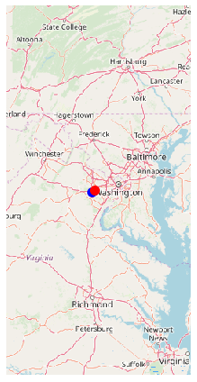

# Choosing an Optimal Route using Fairfax OpenGIS
#### Robert Schroder rtschroder@fcps.edu 


```python
import io
import zipfile
import requests
import networkx as nx
import numpy as np
import pandas as pd
import json
import smopy
import matplotlib.pyplot as plt
import matplotlib
%matplotlib inline
```


```python
#g = nx.read_shp('data/tl_2019_51059_roads.shp')    #Census
#g = nx.read_shp('data/tl_2019_51_prisecroads.shp') #Census
#g = nx.read_shp('data/tl_2013_06_prisecroads.shp') #Census
g = nx.read_shp('data/Roadway_Centerlines.shp') # https://data-fairfaxcountygis.opendata.arcgis.com/datasets/roadway-centerlines
```


```python
def connected_component_subgraphs(G):
    for c in nx.connected_components(G):
        yield G.subgraph(c)
```


```python
sgs = list(connected_component_subgraphs(
    g.to_undirected()))
i = np.argmax([len(sg) for sg in sgs])
sg = sgs[i]
len(sg)
```


    108551


```python
pos0 = (38.8122,-77.4493)
pos1 = (38.8252,-77.4106)
#pos0 = (36.6026, -121.9026)
#pos1 = (34.0569, -118.2427)
```


```python
def get_path(n0, n1):
    """If n0 and n1 are connected nodes in the graph,
    this function returns an array of point
    coordinates along the road linking these two
    nodes."""
    return np.array(json.loads(sg[n0][n1]['Json'])
                    ['coordinates'])
```


```python
# from https://stackoverflow.com/a/8859667/1595060
EARTH_R = 6372.8

def geocalc(lat0, lon0, lat1, lon1):
    """Return the distance (in km) between two points
    in geographical coordinates."""
    lat0 = np.radians(lat0)
    lon0 = np.radians(lon0)
    lat1 = np.radians(lat1)
    lon1 = np.radians(lon1)
    dlon = lon0 - lon1
    y = np.sqrt((np.cos(lat1) * np.sin(dlon)) ** 2 +
        (np.cos(lat0) * np.sin(lat1) - np.sin(lat0) *
         np.cos(lat1) * np.cos(dlon)) ** 2)
    x = np.sin(lat0) * np.sin(lat1) + \
        np.cos(lat0) * np.cos(lat1) * np.cos(dlon)
    c = np.arctan2(y, x)
    return EARTH_R * c
```


```python
def get_path_length(path):
    return np.sum(geocalc(path[1:, 1], path[1:, 0],
                          path[:-1, 1], path[:-1, 0]))
```


```python
# Compute the length of the road segments.
for n0, n1 in sg.edges:
    path = get_path(n0, n1)
    distance = get_path_length(path)
    sg.edges[n0, n1]['distance'] = distance
```


```python
nodes = np.array(sg.nodes())
# Get the closest nodes in the graph.
pos0_i = np.argmin(
    np.sum((nodes[:, ::-1] - pos0)**2, axis=1))
pos1_i = np.argmin(
    np.sum((nodes[:, ::-1] - pos1)**2, axis=1))
```


```python
# Compute the shortest path.
path = nx.shortest_path(
    sg,
    source=tuple(nodes[pos0_i]),
    target=tuple(nodes[pos1_i]),
    weight='distance')
len(path)
```


    27


```python
roads = pd.DataFrame(
    [sg.edges[path[i], path[i + 1]]
     for i in range(len(path) - 1)],
    columns=['FULLNAME', 'SPEED_LIMIT_CAR',
             'RTTYP', 'distance', 'STATUS'])
roads
```


<div>
<style scoped>
    .dataframe tbody tr th:only-of-type {
        vertical-align: middle;
    }

    .dataframe tbody tr th {
        vertical-align: top;
    }

    .dataframe thead th {
        text-align: right;
    }
</style>
<table border="1" class="dataframe">
  <thead>
    <tr style="text-align: right;">
      <th></th>
      <th>FULLNAME</th>
      <th>SPEED_LIMIT_CAR</th>
      <th>RTTYP</th>
      <th>distance</th>
      <th>STATUS</th>
    </tr>
  </thead>
  <tbody>
    <tr>
      <th>0</th>
      <td>OLD CENTREVILLE RD</td>
      <td>NaN</td>
      <td>NaN</td>
      <td>0.080210</td>
      <td>BUILT</td>
    </tr>
    <tr>
      <th>1</th>
      <td>OLD CENTREVILLE RD</td>
      <td>NaN</td>
      <td>NaN</td>
      <td>0.040588</td>
      <td>BUILT</td>
    </tr>
    <tr>
      <th>2</th>
      <td>OLD CENTREVILLE RD</td>
      <td>NaN</td>
      <td>NaN</td>
      <td>0.042658</td>
      <td>BUILT</td>
    </tr>
    <tr>
      <th>3</th>
      <td>OLD CENTREVILLE RD</td>
      <td>NaN</td>
      <td>NaN</td>
      <td>0.087265</td>
      <td>BUILT</td>
    </tr>
    <tr>
      <th>4</th>
      <td>OLD CENTREVILLE RD</td>
      <td>NaN</td>
      <td>NaN</td>
      <td>0.125995</td>
      <td>BUILT</td>
    </tr>
    <tr>
      <th>5</th>
      <td>OLD CENTREVILLE RD</td>
      <td>NaN</td>
      <td>NaN</td>
      <td>0.063614</td>
      <td>BUILT</td>
    </tr>
    <tr>
      <th>6</th>
      <td>OLD CENTREVILLE RD</td>
      <td>NaN</td>
      <td>NaN</td>
      <td>0.184691</td>
      <td>BUILT</td>
    </tr>
    <tr>
      <th>7</th>
      <td>OLD CENTREVILLE RD</td>
      <td>NaN</td>
      <td>NaN</td>
      <td>0.103044</td>
      <td>BUILT</td>
    </tr>
    <tr>
      <th>8</th>
      <td>OLD CENTREVILLE RD</td>
      <td>NaN</td>
      <td>NaN</td>
      <td>0.230764</td>
      <td>BUILT</td>
    </tr>
    <tr>
      <th>9</th>
      <td>OLD CENTREVILLE RD</td>
      <td>NaN</td>
      <td>NaN</td>
      <td>0.005117</td>
      <td>BUILT</td>
    </tr>
    <tr>
      <th>10</th>
      <td>OLD CENTREVILLE RD</td>
      <td>NaN</td>
      <td>NaN</td>
      <td>0.288468</td>
      <td>BUILT</td>
    </tr>
    <tr>
      <th>11</th>
      <td>OLD CENTREVILLE RD</td>
      <td>NaN</td>
      <td>NaN</td>
      <td>0.078419</td>
      <td>BUILT</td>
    </tr>
    <tr>
      <th>12</th>
      <td>OLD CENTREVILLE RD</td>
      <td>NaN</td>
      <td>NaN</td>
      <td>0.239276</td>
      <td>BUILT</td>
    </tr>
    <tr>
      <th>13</th>
      <td>CENTREWOOD DR</td>
      <td>NaN</td>
      <td>NaN</td>
      <td>0.220251</td>
      <td>BUILT</td>
    </tr>
    <tr>
      <th>14</th>
      <td>NEW BRADDOCK RD</td>
      <td>NaN</td>
      <td>NaN</td>
      <td>0.410293</td>
      <td>BUILT</td>
    </tr>
    <tr>
      <th>15</th>
      <td>NEW BRADDOCK RD</td>
      <td>NaN</td>
      <td>NaN</td>
      <td>0.028392</td>
      <td>BUILT</td>
    </tr>
    <tr>
      <th>16</th>
      <td>NEW BRADDOCK RD</td>
      <td>NaN</td>
      <td>NaN</td>
      <td>0.211469</td>
      <td>BUILT</td>
    </tr>
    <tr>
      <th>17</th>
      <td>NEW BRADDOCK RD</td>
      <td>NaN</td>
      <td>NaN</td>
      <td>0.301771</td>
      <td>BUILT</td>
    </tr>
    <tr>
      <th>18</th>
      <td>NEW BRADDOCK RD</td>
      <td>NaN</td>
      <td>NaN</td>
      <td>0.204450</td>
      <td>BUILT</td>
    </tr>
    <tr>
      <th>19</th>
      <td>NEW BRADDOCK RD</td>
      <td>NaN</td>
      <td>NaN</td>
      <td>0.178180</td>
      <td>BUILT</td>
    </tr>
    <tr>
      <th>20</th>
      <td>NEW BRADDOCK RD</td>
      <td>NaN</td>
      <td>NaN</td>
      <td>0.639268</td>
      <td>BUILT</td>
    </tr>
    <tr>
      <th>21</th>
      <td>NEW BRADDOCK RD</td>
      <td>NaN</td>
      <td>NaN</td>
      <td>0.050542</td>
      <td>BUILT</td>
    </tr>
    <tr>
      <th>22</th>
      <td>NEW BRADDOCK RD</td>
      <td>NaN</td>
      <td>NaN</td>
      <td>0.495062</td>
      <td>BUILT</td>
    </tr>
    <tr>
      <th>23</th>
      <td>UNION MILL RD</td>
      <td>NaN</td>
      <td>NaN</td>
      <td>0.116906</td>
      <td>BUILT</td>
    </tr>
    <tr>
      <th>24</th>
      <td>UNION MILL RD</td>
      <td>NaN</td>
      <td>NaN</td>
      <td>0.106900</td>
      <td>BUILT</td>
    </tr>
    <tr>
      <th>25</th>
      <td>UNION MILL RD</td>
      <td>NaN</td>
      <td>NaN</td>
      <td>0.285843</td>
      <td>BUILT</td>
    </tr>
  </tbody>
</table>
</div>


```python
roads['distance'].sum()
```


    4.819436535651768


```python
m = smopy.Map(pos0, pos1, z=7, margin=.1)
```


```python
def get_full_path(path):
    """Return the positions along a path."""
    p_list = []
    curp = None
    for i in range(len(path) - 1):
        p = get_path(path[i], path[i + 1])
        if curp is None:
            curp = p
        if (np.sum((p[0] - curp) ** 2) >
                np.sum((p[-1] - curp) ** 2)):
            p = p[::-1, :]
        p_list.append(p)
        curp = p[-1]
    return np.vstack(p_list)
```


```python
linepath = get_full_path(path)
x, y = m.to_pixels(linepath[:, 1], linepath[:, 0])
```


```python
ax = m.show_mpl(figsize=(6, 6))
#plt.rcParams['figure.figsize'] = [10, 10]
# Plot the itinerary.
ax.plot(x, y, '-k', lw=1.5)
# Mark our two positions.
ax.plot(x[0], y[0], 'ob', ms=10)
ax.plot(x[-1], y[-1], 'or', ms=10)
```


    [<matplotlib.lines.Line2D at 0x1e6853600f0>]





```python

```


```python

```
